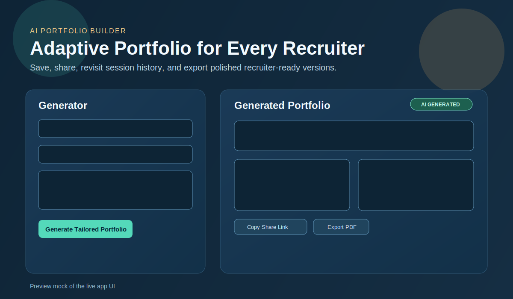

# Adaptive AI Portfolio

An AI-powered personal portfolio web app that rewrites your narrative for each recruiter and role.

## Demo



## Stack
- Frontend: React + TypeScript + Vite
- Backend: Python + FastAPI
- AI: Groq API (with built-in local fallback if no API key is set)

## What this MVP does
- Takes recruiter + company + role + job description input
- Rewrites your summary and project framing for that specific opportunity
- Shows a live tailored preview in the UI
- Saves every generated version with a unique share ID
- Provides recruiter session history in the UI
- Supports share links and export-to-PDF (browser print flow)

## Project structure
- `frontend/` React app
- `backend/` FastAPI API

## Architecture (How it works)
- The React frontend collects recruiter inputs, sends them to `POST /api/tailor`, and renders the tailored portfolio response.
- The FastAPI backend uses Groq (OpenAI-compatible client) to generate recruiter-specific content; if the API key/model call fails, it falls back to deterministic local generation.
- Every generated result is saved into SQLite (`backend/portfolio.db`) with:
  - A numeric `sessionId` for history lookup
  - A unique `shareId` for public share links
- History and share flows:
  - `GET /api/history` returns recent saved sessions for the UI history tab
  - `GET /api/share/{share_id}` loads a shared result (used by `?share=<id>` links)
- PDF export is handled on the client: the app opens a print-friendly HTML view and uses the browser print dialog to save as PDF.

## Run locally

### 1) Backend
```bash
cd backend
python3 -m venv .venv
source .venv/bin/activate
pip install -r requirements.txt
cp .env.example .env
uvicorn app.main:app --reload --port 8000
```

If `GROQ_API_KEY` is empty, the app uses deterministic fallback generation.

### 2) Frontend
```bash
cd frontend
npm install
npm run dev
```

Open `http://localhost:5173`.

## Configure your real portfolio data
Update `frontend/src/data.ts` with your:
- Name and tagline
- Bio
- Skills
- Achievements
- Project links

## API endpoint
- `POST /api/tailor`
- `GET /api/history`
- `GET /api/history/{session_id}`
- `GET /api/share/{share_id}`
- Payload shape:
```json
{
  "recruiter": {
    "recruiterName": "Jordan",
    "company": "Stripe",
    "roleTitle": "Senior Full-Stack Engineer",
    "jobDescription": "...",
    "tone": "technical"
  },
  "basePortfolio": {
    "name": "Your Name",
    "tagline": "...",
    "bio": "...",
    "coreSkills": ["React", "TypeScript"],
    "highlights": ["..."],
    "projects": []
  }
}
```


